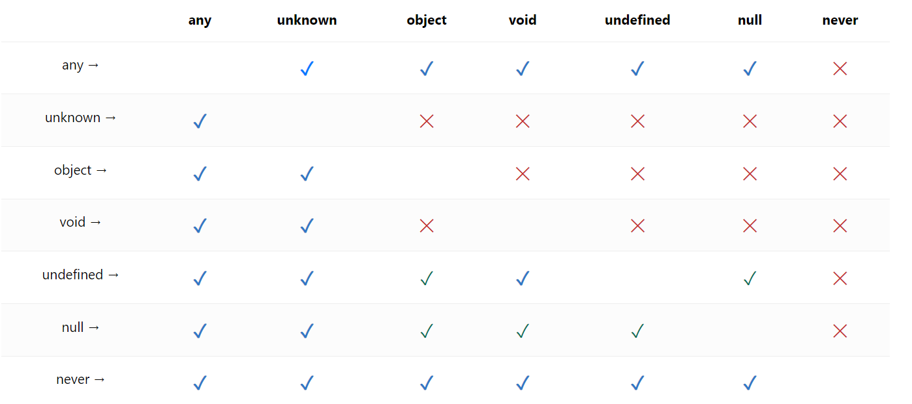

# 섹션2. 기본 문법 배우기

태그: TypeScript

---

## 📚 TypeScript 강의 리포지토리

[GitHub - ZeroCho/ts-all-in-one](https://github.com/ZeroCho/ts-all-in-one?tab=readme-ov-file)

# 🔠 2. 기본 문법 배우기

## 📘 2.1. 타입스크립트는 변수, 매개변수, 리턴값에 타입 붙이는 것!

코드들을 입력해 보면서 ts 문법을 훑어보자

다음 명령어를 실행해 ts파일이 수정될때마다 자동으로 컴파일 실행

```powershell
npx tsc -w
```

기본적으로 변수, 속성, 매개변수, 리턴값에 타입이 붙었다고 생각하면 됨.

- index.ts

```typescript
const a: string = '5';
const b: number = 5;
const c: boolean = false;
const d: undefined = undefined;
const e: null = null;

let f: any = 123;
    f = '123';
    f = true;

// 고정값
const g: true = true;
const h: 4 = 4;

function add(x: number, y: number): number {
  return x + y 
}

// const add2: (x: number, y: number) => number = (x, y) => x + y;

// type Add = (x: number, y: number) => number;
interface AddInterface{
  (x: number, y: number): number
}

const add2: AddInterface = (x, y) => x + y;

interface objInterface {
  lat: number,
  lon: number,
}
// const obj: { lat: number, lon: number } = { lat: 37.5, lon: 127.5 };
const obj: objInterface = { lat: 37.5, lon: 127.5 };

const arr1: string[] = ['123', '456'];
const arr2: Array<string> = ['123', '456'];

const arr3: number[] = [1, 2, 3];
const arr4: Array<number> = [1, 2, 3];

// 튜플
const arr5: [number, number, string] = [ 123, 456, 'hi'];
```

→ 대문자가 아니라 소문자로 타입을 작성한다.

→ 타입 지정 위치 헷깔리지 않도록 주의

## 🔍 2.2. 타입 추론을 적극 활용하자

- index.ts

```typescript
// const a: string = '5';
// const b: number = 5;
// const c: boolean = false;
// const d: undefined = undefined;
// const e: null = null;

// * 타입 추론
const a = '5';
const b = 5;
const c = false;
const d = undefined;
const e = null;

// const arr1: string[] = ['123', '456'];
// const arr2: Array<string> = ['123', '456'];

// const arr3: number[] = [1, 2, 3];
// const arr4: Array<number> = [1, 2, 3];

// 튜플
// const arr5: [number, number, string] = [ 123, 456, 'hi'];

// * 타입 추론
const arr2 = ['123', '456']; // string[]
const arr4 = [1, 2, 3]; // number[]

// 튜플
const arr5 = [ 123, 456, 'hi']; // (string | number)[]

const obj2 = { lat: 37.5, lon: 127.5 }; // { lat: number; lon: number; }
```

→ 정확하게 타입추론되는 상황에서 굳이 타입을 지정해줄 필요 없다.

## 👀 2.3. js 변환 시 사라지는 부분을 파악하자

- index.ts

```typescript
...

// * 타입 단언
let aa = 123;
aa = 'hi' as unknown as number;
```

ts에서 js로 컴파일될때 타입이 지정된 부분은 전부 다 사라진다.

## ❗️ 2.4. never 타입과 느낌표(non-null assertion)

- index.ts

```typescript
/* 
	빈 배열 선언 시 타입을 지정하지 않으면 never[]로 추론되므로
	애초에 빈 배열을 선언할 때 타입을 지정해 주자
*/ 
const array = []; // never[]  
array.push('hi'); // array: never[] -> array: any[]
```

`document.querySelector()` 메서드를 실행할때 반환값 타입이

`Element`로 딱 떨어지는 게 아니라 

해당 Element 요소가 없는 경우를 고려해서 `Element | null`로 반환된다.

- index.ts

```typescript
...

// '#head'가 없을 경우를 고려해서 Element | null로 타입이 추론된다.
const head = document.querySelector('#head'); // Element | null
```

이럴 경우 아래와 같이 `!`를 붙여서 해당 값의 타입이 `null`, `undefined`가 아님을 보증해줄 수 있다.

- index.ts

```typescript
...

// `!`를 붙여서 null, undefined가 아님을 보증
const section = document.querySelector('#section')!; // Element 
```

근데 위와 같이 `!`(non-null assertion)를 사용하는 방식은 좋지 않다.

왜냐면 해당 값이 어떻게 될지 모르기 때문이다.

다음과 같이 조건문을으로 해당 값이 존재함을 보장해주는 방식을 사용하는 게 

안정성도 높고 적절하다.

- index.ts

```typescript
...

// 근데 위와 같은 방식은 비추이므로
// if 같은 조건문으로 해당 값이 존재함을 보장해주는 방식을 사용하자
if(head){
  head.textContent = 'dada'; // head 요소의 값이 보장되므로 타입 에러를 발생하지 않는다.
}
```

## 📘 2.5. 원시 래퍼 타입, 템플릿 리터럴 타입, rest, 튜플

- 원시 래퍼 타입
    
    타입을 지정할때 해당 타입을 대문자로 지정할 경우
    
    의도하지 않는 상황이 생긴다.
    
    예를 들어 다음과 같이 타입을 `string` 이 아닌 `String`으로 타입을 지정할 경우 
    
    `String`은 참조 객체 `String`을 뜻 하므로 
    
    문자열 `string` 타입을 지정하는 게 아니게 되어 버린다.
    
    - index.ts
    
    ```typescript
    const a: string = 'hi';
    
    // String은 래퍼 객체, 내장 함수 String을 뜻함 -> interface String
    const b: String = 'hell'; 
    ```
    
- timeplate literal type
    - index.ts
    
    ```typescript
      type World  = 'world' | 'hell';
      
      // 템플릿 리터럴 타입
      type Greeting = `hello ${World}`; 
      // -> type Greeting = "hello hell" | "hello world"
    ```
    
- `rest`
    - index.ts
    
    ```typescript
      // rest
      let arr: string[] = [];
      let arr2: Array<string> = [];
    
      function rest(a: number, ...args: string[]){
        console.log(a, args);    
      }
    
      rest(1, ...['1', '2', '3']);
    ```
    

- `tuple`
    - index.ts
    
    ```typescript
    // tuple
    const tuple: [string, number] = ['1', 1];
    
    tuple[2]  = 'hello'; // ❌
    
    tuple.push('hello'); // ⭕️
    ```
    

## 📘 2.6. enum, keyof, typeof

- `enum`
    
    enum은 js로 컴파일될떄 숫자로 치환된다.
    
    숫자, 문자열 타입 값을 설정할 수 있다.
    
    보통 변수들을 하나의 그룹으로 묶고 싶을 때 사용한다.
    
    - index.ts
    
    ```typescript
      // * enum
      // -> enum은 js로 컴파일될떄 숫자로 치환된다.
      // -> 숫자, 문자열 타입 값을 설정할 수 있다.
      // -> 보통 변수들을 하나의 그룹으로 묶고 싶을 때 사용한다.
      
      // - 기본값
      {
        const enum EDirection {
          Up,    // 0
          Down,  // 1
          Left,  // 2
          Right, // 3
        }
      
        const a = EDirection.Up;    // 0
        const b = EDirection.Down;  // 1
        const c = EDirection.Left;  // 2
        const d = EDirection.Right; // 3
      }
    
      // - 순서 설정, 앞에 설정된 순서의 이후 순서값으로 자동 설정된다.
      {
        const enum EDirection {
          Up = 3 , // 3
          Down,    // 4
          Left,    // 5
          Right,   // 6
        }
      
        const a = EDirection.Up;    // 3
        const b = EDirection.Down;  // 4
        const c = EDirection.Left;  // 5
        const d = EDirection.Right; // 6
      }
    
      // - 순서 설정, 맘대로 불규칙하게 순서를 설정
      {
        const enum EDirection {
          Up = 3 ,    // 3
          Down = 5,   // 5
          Left = 4,   // 4
          Right = 6,  // 6
        }
      
        const a = EDirection.Up;    // 3
        const b = EDirection.Down;  // 5
        const c = EDirection.Left;  // 4
        const d = EDirection.Right; // 6
      }
    ```
    

- `as const`
    - index.ts
    
    ```typescript
    // * as const
    
    // 1. 설정한 값이 아닌 설정한 값의 타입으로 타입이 지정된 상황
    const ODirection1 = { 
      Up: 0,
      Down: 1,
      Left: 2,
      Right: 3,
    } 
    // -> ODirection1: { Up: number; Down: number; Left: number; Right: number; }
    
    // 2. `as const`를 붙여서 정확하게 해당 값으로 타입을 지정, 
    //    수정할 수 없도록 `readonly` 키워드로 고정되게 된다.
    const ODirection2 = { 
      Up: 0,
      Down: 1,
      Left: 2,
      Right: 3,
    } as const; 
    // -> ODirection2: { readonly Up: 0; readonly Down: 1; readonly Left: 2; readonly Right: 3; }    
    
    // -> readonly 키워드 또한 TypeScript이므로 JavaScript로 컴파일될때 사라진다.
    ```
    

- `keyof`
    - index.ts
    
    ```typescript
    // * keyof
    
    // - 객체의 `key`들을 타입으로 추출
      const obj = {
        a: '123',
        b: 'hello',
        c: 'world',
      };
    
    // 1. `typeof` 키워드로 obj에서 타입을 추출 
    //     -> obj: { a: string; b: string; c: string; }
    // 2. 추출된 해당 타입에서 `keyof` 키워드로 `key`만 추출 
    //     -> type key = "a" | "b" | "c"
    type key = keyof typeof obj; // "a" | "b" | "c"
    /*
      - obj 객체는 JavaScript 값이므로 타입으로 쓸 수 없기 때문에 
        typeof 키워드로 타입으로 추출하고
        추출한 해당 타입에 `keyof` 키워드로 `key`만 추출한 것이다.
    */
    
    // - 객체의 `value`들을 타입으로 추출
    const obj2 = {
      a: '123',
      b: 'hello',
      c: 'world',
    } as const;
    
    // 1. `value`를 타입으로 추출할 해당 객체가 `as const` 키워드로 설정되어야 해당 객체의 값을 정확하게 추출한다.
    //   1.1. 해당 객체에 `as const` 키워드가 없을 경우
    //        해당 객체의 타입은 값이 아닌 타입(ex: string)로 널널하게 추론되므로 값으로 타입이 추출되지않는다.
    // 2. 객체의 `value`들을 타입으로 추출
    type key2 = typeof obj2 [keyof typeof obj2]; // "123" | "hello" | "world"
    
    ```
    

## 📘 2.7. type alias(타입 정의), interface, union(`|`)과 intersection(`&`)

- type alias(타입 정의)
    - index.ts
    
    ```typescript
    // - type alias(타입 정의)
    type A = { a: string; }; // { a: string; }
    const a: A = { a: 'hello' };
    ```
    
- interface
    - index.ts
    
    ```typescript
    // - interface
    interface B {a: string; }; // { a: string; }
    const b: B = { a: 'hello' }; 
    ```
    

- union( `|` )
    - index.ts
    
    ```typescript
    // - union(|)
    function add(x: string | number, y: string | number): string | number {    
      if ([x, y].every((item)=> (typeof item) === 'number')) {
        return (+x) + (+y);
      }
      return (x+'') + (y+'');
    }
    
    add(1, 2);
    add('1', '2');
    add(1, '2');
    ```
    
- intersection( `&` )
    - index.ts
    
    ```typescript
    // - intersection(&)
    //   둘 다 만족
    type C = { hello: 'world' } & { zero: 'cho' }; // { hello: "world"; } & { zero: "cho"; }
    
    const c: C = {
      hello: 'world',
      zero: 'cho',
    };
    
    ```
    
- union( `|` )
    - index.ts
    
    ```typescript
    // union(|)으로도 합치기 가능 다만 의미는 다르다.
    type D = { hello: 'world' } | { zero: 'cho' }; // { hello: "world"; } | { zero: "cho"; }
    
    const d: D = {
      hello: 'world',
      zero: 'cho',
    };
    
    // A 또는 B 라는 의미가 되므로
    // 둘 중 하나의 타입만 만족해도 되게된다.
    const d2: D = {
      hello: 'world',    
    };
    
    ```
    
    <aside>
    💡
    
    - intersection(`&`): 모든 속성이 다 존재해야한다.
    - union(`|`): 여러개 중에 하나만 있어도 된다.
    </aside>
    

## 📘 2.8. type alias와 인터페이스의 상속(extends)

- type alias의 상속(extends)
    
    intersection( `&` )을 사용해 타입을 확장시킨다.
    
    - index.ts
    
    ```typescript
    // - type alias의 상속(extends)
    type Animal = { breath: true }; // { breed: true; }
    type Poyouryu = Animal & {breed: true}; // -> { breath: true; breed: true; }
    type Human = Poyouryu & {think: true}; // -> { breath: true; breed: true; think: true }
    
    const jin: Human = { // { breath: true; breed: true; think: true }
      breath: true,
      breed: true,
      think: true,
    };
    ```
    

- interface의 상속(extends)
    1. interface로 선언한 타입에 extends 키워드를 사용해 이전에 선언된 타입을 상속받아서 확장시킨다.
        
        ( 같은 interface로 선언한 타입 뿐 만 아니라 type alias를 사용해 선언한 타입을 상속받는 것도 가능)
        
    
    1. interface는 식별자 중복 가능, type은 불가능
        
        식별자가 중복되면 식별자가 동일한 interface 끼리 합쳐진다. 
        
        (이 특성을 기반으로 라이브러리에 선언된 interfae를 수정할 수 있다.)
        
    - index.ts
    
    ```typescript
    // - interface의 상속(extends)
    interface A {
      breath: true,
    }
    
    interface B extends A { // interface A를 상속 받아서 확장    
      breed: true,
    } 
    // -> { breath: true; breed: true; }
    // interface가 같은 interface 뿐 만 아니라 type alias을 extends 하는것도 가능.
    
    const jin2: B = { // { breath: true; breed: true; }
      breath: true,
      breed: true,    
    };
    
    // * interface는 식별자 중복 가능, type은 불가능
    // * 식별자가 중복되면 식별자가 동일한 interface 끼리 합쳐진다. (이 특성을 기반으로 라이브러리에 선언된 interfae를 수정할 수 있다.)
    interface A {
      // talk: ()=> void;
    }
    interface A {
      // eat: ()=> void;
    }
    interface A {
      // shit: ()=> void;
    }
    ```
    

<aside>
💡

interface, type alias 네이밍(옛날 방식)

---

식별자에 다음과 같은 키워드를 붙인다.
interface -> I
type -> T
enum -> E

</aside>

## 📘 2.9. 타입을 집합으로 생각하자(좁은 타입과 넓은 타입)

타입 스크립트를 사용할 때 항상 정확하게 특정 타입만 넣는 경우가 생기는 게 아니라

넓은 타입에 좁은 타입을 넣으려고 시도할 수 있고

좁읍 타입에 넓은 타입을 넣으려고 시도할 수도 있게 된다.

이때 큰 타입과 좁읍 타입을 구분할 줄 알아야 하므로 알아보도록 하자

다음과 같이 타입 `A`와 `B`가 있을 경우 

어떤 게 더 넓은 타입이냐면 타입 `A`가 더 넓은 타입이다.

- index.ts

```typescript
// 집합으로 생각하기
type A = string | number; // 넓은 타입, 
type B = string; // 좁은 타입, 
```

그 이유는 집합 관계로 생각을 해보면 알 수 있다.

- union( `|` ) 즉, 또는(or) 관계일 경우
    
    ```typescript
    type A = string | number; // string | number
    ```
    
    `string` 또는 `number` 타입이 될 수 있기 때문에 다음과 같이 전체 범위를 나타낸다.
    
    
    

- intersection( `&` )일 경우
    
    ```typescript
    type C = string & number // never
    ```
    
    `string` 과 `number` 타입이 둘 다 만족하는 범위이므로 다음과 같은 좁은 범위를 나타낸다.
    
    
    
    그런데 `string & number` 라는 타입은 없으므로
    
    결과로 `never` 타입이 나오는 것을 볼 수 있으며 사실상 없는 타입이다.
    
    
    

---

위와 같이 집합으로 생각해 봤을 때 `string | number`가 `string` 보다 더 넓은 타입이며

<aside>
💡

비슷한 원리로 `any` 타입은 전체 집합

`never` 타입은 교집합으로 볼 수 있다.

</aside>

<aside>
💡

- 좁은 타입에서 넓은 타입으로 대입이 가능하다. ( `넓은 타입 = 좁은 타입` ⭕️ )
- 반대로 넓은 타입에서 좁은 타입으로 대입은 불가능하다. ( `좁은 타입  = 넓은 타입` ❌ )
</aside>

- index.ts

```typescript
  // 집합으로 생각하기
  type A = string | number; // 넓은 타입
  type B = string; // 좁은 타입
  
  type C = string & number; // never, 교집합
```

위 예제 코드로 확인해보자면 

`string` 에서 `string | number`타입으로 대입이 가능할테고

`string | number` 에서 `string` 타입으로 대입은 불가능 할 것이다.

그럼 `string & number` 의 경우 

위에 코드 중에서 좁은 타입에 속하는 `string` 중 어떤 게 더 좁은 타입일까?

→ `never` 타입은 교집합이므로 당연히 `string & number` 타입이 더 넓다.

 객체 타입에서의 넓은 타입과 좁은타입

위에서 넓은 타입과 좁은 타입에 대해서 알아보았는데

객체에서의 넓은 타입과 좁은 타입에 대해 알아보자

객체 타입에서 어떤 게 넓은 타입이고 좁은 타입인지 파악해도록 하자

우선 다음과 같이 두 객체 타입에서는 아직까지 겹치는 건 없기 때문에 

어떤 게 더 넓은 타입인지 좁은 타입인지 비교할 수는 없다.

- index.ts

```typescript
// * 객체 타입에서의 넓은 타입과 좁은 타입

type A = { name: string };
type B = { age: number };
```

그럼 위에 코드에서 다음과 같이 객체 타입 `C`를 새로 추가해

객체 타입 `A`, `B`와 `C` 중 어떤게 더 넓은 타입인지 좁은 타입인지 비교를 해보도록 하자

- index.ts

```typescript
// * 객체 타입에서의 넓은 타입과 좁은 타입

// - 객체 타입은 상세할 수록 넓은 타입이다.
type A = { name: string };
type B = { age: number };

type C = { name: string, age: number };
```

<aside>
⚠️

보통은 객체 타입 `C`가 속성이 더 많다고 객체 타입 `C`가 더 넓은 타입으로 착각하곤 한다.

그러나 객체 타입의 경우 속성이 적을 수록 넓은 타입이다.

이와 같은 경우는 어떻게 기억해야 하냐면

객체 타입의 경우 상세할수록 좁다고 생각해야 된다.

즉, 구체적인 것일수록 좁은 타입이라는 말이다.

</aside>

그럼 위에 예제 코드 객체 타입 `A`, `B` 와 `C` 중에서는 

객체 타입 `A`, `B`가 `C` 보다 더 넓은 타입인 것이다.

그럼 이어서 객체 타입 `A`, `B` 보다 더 넓은 타입을 만들어 보자면

union( `|` )으로 `A | B` 타입을 선언할 수 있겠다.

- index.ts

```typescript
// - 객체 타입은 상세할 수록 넓은 타입이다.
type A = { name: string };
type B = { age: number };

// * union(|)
type AB = A | B; // A와 B타입의 합집합 -> 넓은 타입

const ab: AB = { name: 'jin' }; // ⭕️
const ab: AB = { age: 28 }; // ⭕️
const ab: AB = { name: 'jin', age: 28 }; // ⭕️

...
```

`A | B` 타입 또한 집합 관계로 보면 

다음과 같이 `A`와 `B` 타입의 합집합이다.


타입 `A` 또는 타입 `B` 도 될 수 있고 

타입 `A`, `B`를 합친 타입이 될 수 도 있다.

---

그럼 타입 `A`, `B`와 보다 좁은 타입인 객체 타입 `C`를

 instersection( `&` )을 사용해 `A & B`로 표현해서 치환할 수 도 있다.

- index.ts

```typescript
// - 객체 타입은 상세할 수록 넓은 타입이다.
type A = { name: string };
type B = { age: number };

...

// * intersection(&)
// type C = { name: string, age: number };

// A와 B타입의 교집합 -> 좁은 타입, { name: string, age: number };와 동일하다.
type C = A & B; 

const c: C = { name: 'jin', age: 28 }; // ⭕️
const c: C = { name: 'jin' }; // ❌
const c: C = { age: 28 }; // ❌
```

`A & B` 타입 또한 집합 관계로 보면 다음과 같다.


`A & B` 타입은 타입 `A`와 `B`의 교집합이므로

즉, 객체 타입 `{ name: string, age: number }`이니까

`A & B` 타입은 `type A = { name: string }`, `type B ={ age: number }` 보다 좁은 타입이다.

### 📝 2.9.1. `넓은 타입 = 좁은 타입`, `좁은 타입 = 넓은 타입` 실습

- index.ts

```typescript
// - 객체 타입은 상세할 수록 넓은 타입이다.
type A = { name: string };
type B = { age: number };

// * union(|)
// A와 B타입의 합집합 -> 넓은 타입
type AB = A | B;

...

// * intersection(&)
// type C = { name: string, age: number };

// A와 B타입의 교집합 -> 좁은 타입 
type C = A & B; // { name: string, age: number };와 동일하다.

...

const ab1: AB = { name: 'jin' }; // `A | B` 타입 합집합 이므로 ⭕️
const c1: C = { name: 'jin', age: 28}; // `A & B` 타입 교집합 이므로 ⭕️

// * 좁은 타입 = 넓은 타입
const c2: C = ab; // `A & B` 타입 교집합 `C` 보다 넓은 합집합 타입  `A | B` 타입 `ab`는 대입 불가능 ❌

// * 넓은 타입 = 좁은 타입
const ab2: AB = c; // 합집합 `A | B`에 교집합 `A & B`를 대입하는 것이므로 가능 ⭕️      

// -> 속성이 타입이 넓은지 좁은지로 따질 수 있다.

```

### 🔍 2.9.2. 잉여 속성 검사

아래에서 `interface A`에는 `a` 속성밖에 존재하지 않으므로

`obj`에 `interface A`를 대입하자 `interface A`에 `b` 속성이 존재하지 않는다고 에러가 출력되는 상황이다.


위와 같은 상황에서 다음과 같이 

변수로 한번 빼니까 검사를 안하며 위와 같이 에러를 출력하지 않는 것을 볼 수 있다.


## 📘 2.10 void의 두 가지 사용법

반환하는 값이 없을 경우를 뜻하며 

함수가 반환하는 값 중 `undefined`는 가능하고


`null`은 불가능하다.


즉, 다음과 같이 적용해볼 수 있다.

- index.ts

```typescript
interface Human{
  talk: () => void;
}

const human: Human = {
  // 반환하는 값이 없으므로 void에 해당
  talk(){ 
	  // return;
    // return undefined;
  }
}
```

그런데 다음과 같이 `human.talk()` 메서드에서 

문자열을 반환하도록 작성했음에도 에러가 출력되지 않는 상황이 발생했다.


<aside>
💡

애초에 `void`를 반환하는 함수를 선언한 것과

함수의 매개변수로 선언한 `void`

객체 내부에 `void`를 반환하는 메서드로 선언할 때 

각각 역할이 조금 다르다고 보면 된다.

```typescript
// void를 반환하는 함수
function a(): void { 

}

// 매개변수로 선언한 void
function b(callback: ()=> void): void{
  
}

interface Human{
	// 객체 내부에 void를 반환하는 메서드
  talk: () => void;
}

...
```

`void`가 위와 같이 세가지 종류가 크게 나올 수 있는데

- return 값이 `void` 일때
- 매개변수에 `void`를 반환하는 함수가 들어올때
- 객체 내부에 메서드가 `void`를 반환하도록 선언될때

```typescript
...

// 매개변수로 선언한 void
function b(callback: ()=> void): void{
  
}

// b함수 매개변수에는 void로 설정되었으나
// 문자열을 반환하는 함수를 전달했음에도 에러가 출력되지 않는다.
b(()=>{
	return '3';
});
```

`void`는 함수의 직접적인 return 값이 `void`인 경우에만 

return을 `void`가 아닌 다른 타입의 값을 반환하면 에러가 출력된다. 

</aside>

다음과 같이 인자로 `number[]`와 `(el: number)⇒ undefined`를 전달받는 

`forEach()` 함수를 선언후 타입을 설정하고 

`forEach()` 함수를 호출할때 배열 `[1, 2, 3]`과 콜백 `el ⇒ target.push(el)`을 전달하자

콜백을 전달하는 부분에서 에러가 출력되는 것을 볼 수 있다.


위와 같이 에러가 발생하는 이유는 `Array.prototype.push()`메서드는 숫자 타입 값을 반환하기 때문에 

`forEach()`함수 두 번째 인자의 콜백에 반환값이 `undefined`로 설정되어 있기 때문에

에러가 반환되는 것이다.

그럼 다음과 같이 `forEach()` 함수 두 번째 인자 콜백의 반환값 타입을 `number`로 설정하면

에러가 발생하지 않겠다.


그러나 `number`가 아닌 `void` 타입으로 설정해도 타입 에러가 발생하지 않는 것을 볼 수 있다.


- index.ts

```typescript
// * 함수에 직접적으로 대입한 void와 매개변수 콜백의 void, method의 void는 서로 다르다.
// declare function forEach(arr: number[], callback:(el: number)=> undefined): void; // ❌
// declare function forEach(arr: number[], callback:(el: number)=> number): void; // ⭕️

// - 즉, 매개변수에서 쓰이는 void는 실제 return 값이 뭐든 상관하지 않겠다는 의미인 것이다.
declare function forEach(arr: number[], callback:(el: number)=> void): void; // ⭕️

let target: number[] = [];
forEach([1, 2, 3], el => target.push(el))

```

<aside>
💡

매개변수에서 쓰이는 `void`는 실제 return 값이 뭐든 상관하지 않겠다는 의미다.

</aside>

## 📘 2.11. unknown과 any(그리고 타입 대입가능표)

- 타입간 대입 가능 표(화살표 방향으로 읽어서 대입 되는지 확인)



- index.ts

```typescript
// * unknown과 any(그리고 타입 대입가능표)
// 1. any타입을 쓸 바에는 unknown 타입을 쓰도록 하자
//  1.1. any타입을 설정하면 ts가 타입 자체를 검사지 않는다.

// 2. unknown 타입을 설정하면 직접 타입을 설정해줘야 한다.
//  2.2. 타입 단언(as)로 정해진 타입만 쓸 수 있도록 

try {
  
} catch (error) {
  // (error as Error).message;
}
```

## 📘 2.12. 타입 좁히기( 타입 가드 )

- index.ts

```typescript
// 전달받는 매개변수가 number 또는 string 타입이므로 
// 조건문에서 typeof 연산자를 사용해 해당 타입일때 특정 동작을 처리하도록 타입을 보장한다.
// ( 타입 단언(as)을 사용하는건 권장하지 않는다. )
function numOrStr(a: number | string){
  if(typeof a === 'string'){
    a.split(',');
  }else if(typeof a === 'number'){
    a.toFixed(1);
  }
}  
numOrStr('123');
numOrStr(1);
```

- index.ts

```typescript
...

function numOrNumArray(a: number | number[]){
  if(Array.isArray(a)){ // number[]
    a.concat(4);
  }else if(typeof a === 'number'){ // number
    a.toFixed(1);
  }
}
numOrNumArray(123);
numOrNumArray([1, 2, 3]);
```

원시 값일 때는 `typeof` 연산자를 쓰고 

배열일 때는 `Array.isArray()` 메서드를 활용해 타입 가드를 해주면 된다.

### 📘 2.12.1. 클래스 타입 가드( `instanceof` 연산자 )

클래스간에는 다음과 같이 `instanceof` 연산자로 구별을 한다.

- index.ts

```typescript
...

class A{
  aaa(){}
}

class B{
  bbb(){}
}

// * 클래스는 그 자체로도 타입이 될 수 있다.
// * 단, 클래스 자체를 의미하는 게 아니라 해당 클래스로 생성한 인스턴스 객체를 의미한다.
// -> 인스턴스 타이핑은 클래스 이름으로 한다.
function aOrB(param: A | B){
  if(param instanceof A){ // 클래스 A의 인스턴스일 때
    param.aaa();
  }else if(param instanceof B){ // 클래스 B의 인스턴스일 때
    param.bbb();
  }
}

// aOrB(A); // ❌ 'typeof A' 형식의 인수는 'A | B' 형식의 매개 변수에 할당될 수 없습니다. 

aOrB(new A());
aOrB(new B());
```

### 📘 2.12.2. 객체 타입 가드

다음과 같이 객체 형식의 타입들이 있을때 

`typeCheck()` 함수에 인자로 전달받는 객체의 타입을 체킹 해야할 경우

전달 받는 객체의 속성 값 또는 속성의 key로 구별을 할 수 있다.

### 🔍 2.12.2.1. 객체 속성의 값으로 구분하기

- index.ts

```typescript
...
  
type B = { type: 'b', bbb: string};
type C = { type: 'c', ccc: string};
type D = { type: 'd', ddd: string};

type Bcd = B | C | D;

function typeCheck(a: Bcd){

	// 전달 받는 객체의 속성으로 타입을 구별
  if(a.type === 'b'){
    a.bbb; // ⭕️
  }else if(a.type === 'c'){        
    a.ccc; // ⭕️
  }else if(a.type === 'd'){        
    a.ddd; // ⭕️
  }
}
```

### 🔍 2.12.2.1. 객체 속성의 key로 구분하기 ( `in` 연산자 )

- index.ts

```typescript
// 다음과 같이 객체 형식의 타입들이 있을때 
// 함수에 인자로 전달받는 객체의 타입을 체킹 해야할 경우
// 전달 받는 객체의 속성 값 또는 속성의 key로 구별을 할 수 있다.
type B ={ type: 'b', bbb: string};
type C ={ type: 'c', ccc: string};
type D ={ type: 'd', ddd: string};

type Bcd = B | C | D;

function typeCheck(a: Bcd){
	
	// * 전달 받는 객체의 속성의 key로 타입을 구별( in 연산자 활용 )
  if('bbb' in a){ // 'bbb' 속성이 a객체에 있을때
    a.type; // -> a: B
  }else if ('ccc' in a){ // 'bbb' 속성이 a객체에 있을때
    a.type; // -> a: C
  }else if('ddd' in a){ // 'ddd' 속성이 a객체에 있을때
    a.type; // -> a: D
  }
}  
```

만약 객체에 `type` 속성 같은 각 객체를 구별할 속성이 없을 경우

각 객체 마다 차이점을 찾아서 구별해준다.

## 📘 2.13. 커스텀 타입 가드(is, 형식 조건자)

- index.ts

```typescript
interface Cat{
  meow: number;
};

interface Dog{
  bow: number;
};

// * 타입 판별 커스텀 함수, 반환 타입에 is가 있으면 커스텀 타입가드 함수다.
// - 커스텀 타입가드 함수는 조건문 안에서 사용한다.
// - if문 같은 조건문 안에 써서 ts한테 정확한 타입이 뭔지 알려주는 것이다.
// - is 키워드가 없을 경우 if문 안에 들어갔을때 ts가 구분할 수 없다.
function catOrDog(a: Cat | Dog): a is Dog {
  if('meow' in a){return false}
  return true;
}

function pet(a: Cat | Dog){
  if(!catOrDog(a)){ // false 면 Cat
    console.log(a.meow);      
  }else{ // true 면 Dog
    console.log(a.bow);      
  }
}
```

## 📘 2.14. `{}`와 `Object`

- index.ts

```typescript
// * {}, Object은 ts에서 객체가 아니라 null과 undefined 제외한 모든 타입을 가리킨다.
const x: {} = 'hello'; // ⭕️
const y: Object = 'hi'; // ⭕️

// const x: {} = null; // ❌
// const x: {} = undefined; // ❌ 

// * object는 객체 타입을 나타낸다.
const xx: object = 'hi'; // ❌, 'string' 형식은 'object' 형식에 할당할 수 없습니다.
const yy: object = {hello: 'world'}; // object 지양, interface, type, class 사용을 지향

// unknown 타입은 모든 타입을 대입할 수 있다.
const z: unknown = 'hi';

// unknown = {} | null | undefined
if(z){ // unknown
  z; // {}
}else{
  z; // unknown
}
```

## 📘 2.15. readonly, 인덱스드 시그니처, 맵드 타입스

### 📘 2.15.1. readonly

타입 속성 앞에 `readonly` 를 붙여서 읽기 전용 속성으로 설정해

변경할 수 없도록 할 수 있다.

- index.ts

```typescript
  interface A {
    readonly a: string;
    b: string;
  }
  const a: A = {
    a: 'hello',
    b: 'world',
  };

  a.a = '123'; // 🚨 읽기 전용 속성이므로 'a'에 할당할 수 없습니다.
```

### 📘 2.15.2. 인덱스드 시그니처

- index.ts

```typescript
// - 인덱스드 시그니처
// 
interface B {
  [key: string] : string;
  // a: string;
  // b: string;
  // c: string;
};

const b: B = {
  a: '1',
  b: '2',
  c: '3',
};

interface C {
  [key: string] : number;
  // a: number;
  // b: number;
  // c: number;
};

const c: C = {
  a: 1,
  b: 2,
  c: 3,
};
```

### 📘 2.15.3. 맵드 타입스

- index.ts

```typescript
type D = 'Human' | 'Mammal' | 'Animal';

// 타입 D에 해당하는 문자열 값으로 key를 제한을 걸 수 있다.
type E = {
  [key in D]: number;
  // [key in D]: D; // 값에 적용도 할 수 있다.
};

const e:E = {
  Human: 123,
  Mammal: 12,
  Animal: 1,
};
```

## 📘 2.16. 클래스의 새로운 기능들

### 📘 2.16.1. 클래스 타이핑

- index.ts

```typescript
class A {
  // * ts에서의 private
  private a: string;
  private b: number;

  // * js에서의 private
  // #a = '';
  // #b = 123;    
  
  constructor(a: string = '', b: number = 123){
    this.a = '123';
    this.b = 123;
  }

  method(){
		...
  }

}

typeof A; // class A를 가리킨다.
type AA = A; // class A가 아니라 new A를 가리킨다.

const a: A = new A('123');
```

### 📘 2.16.2. `private`, `protected`, `private` 클래스 키워드

- index.ts

```typescript
class B {
	// * 클래스 내부에서만 접근이 가능한 속성, 상속 불가능
  private a: string = '123'; 
  
  // * 클래스 내부에서만 접근이 가능한 속성, 상속 불가능
  protected b: string = '';  
  
  // * 인스턴스에서도 접근이 가능한 속성, public 키워드는 기본값이므로 안붙여도 된다.
  public c: number = 123;    

  method(){
    console.log(this.a);
    console.log(this.b);
    console.log(this.c);                
  }
}

// B 클래스를 상속 받는다.
class C extends B {

  method(){
	  // 🚨 'a' 속성은 private이며 'B' 클래스 내부에서만 액세스할 수 있다. 인스턴스에서 접근 불가능
    console.log(this.a);
  
	  // 상속 받은 자식 클래스 내부에서도 protected 속성에 접근이 기능하다. 인스턴스에서 접근 불가능
    console.log(this.b);
    
	  // public 속성이므로 상속 받은 자식 클래스 내부 및 인스턴스에서도 접근 가능  
    console.log(this.c);
  }
}

new C().a; // 🚨 a는 private 속성이므로 클래스 내부세어만 접근이 가능, 상속 불가능
new C().b; // 🚨 b는 protected 속성이므로 클래스 내부에서만 접근이 가능, 상속 가능
new C().c; // c는 public 속성이므로 인스턴스에서 접근이 가능
```

|  | public | protected | private |
| --- | --- | --- | --- |
| 클래스 내부 | ⭕️ | ⭕️ | ⭕️ |
| 인스턴스 | ⭕️ | ❌ | ❌ |
| 상속 클래스 | ⭕️ | ⭕️ | ❌ |

## 📘 2.17. 옵셔널, 제네릭 기본

### 📘 2.17.1 옵셔널

- index.ts

```typescript
// - 옵셔널
function abc(a: number, b?: number, c?: number){}

abc(1);       // ⭕️
abc(1, 2);    // ⭕️
abc(1, 2, 3); // ⭕️

// rest parameter
function abcd(...rest: number[]){}

interface Obj {
  a: string; 
  b?: string
}

const obj: Obj = {
  a: 'hello',
  // b: 'world',
};
```

### 📘 2.17.2 제네릭


- index.ts

```typescript
// extends 키워드로 제네릭 T를 number | string  타입으로 제한 시킨다.
function add<T extends number | string>(x: T, y: T): T {
	return x;
}

add(1, 2);
add('1', '2');
```

- index.ts

```typescript
// 제네릭을 T, K 두개를 전달받아 적용한다.
function add<T extends string, K extends number>(x: T, y: K): T | K{
	return x;
}    

add<string, number>('1', 2); 
```

- index.ts

```typescript
// {a: string} 형식 객체 타입만 전달받도록 제한
function add<T extends {a: string}>(x: T): T{
  return x;
}

add<{a: string}>({a: 'hellow'});
```

- index.ts

```typescript
// 콜백 함수의 형태를 제한
function add4<T extends (a: string)=> number >(x: T): T{
  return x;
}
add4((a)=> +a);
```

---